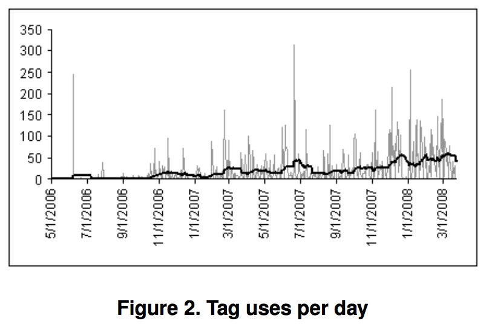
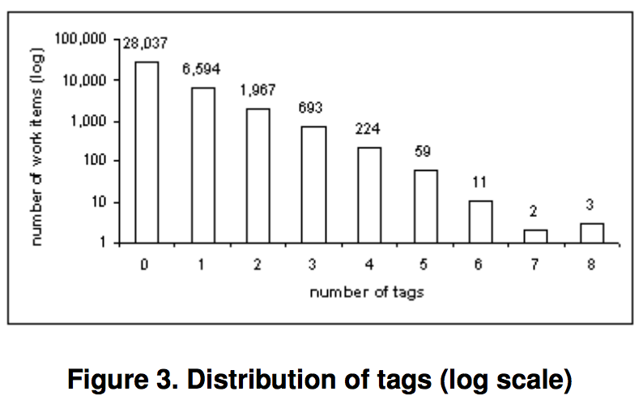

### Team D

### Reference
How tagging helps bridge the gap between social and technical aspects in software development

### Keywords 

- **Tagging** - tagging is a lightweight yet very useful mechanism in helping in developers’ communication and bridging the gap between social and technical aspects [2]. It provides a simple way for annotations in which a developer could tag his artifacts so that others could search and find them. 

- **Collaborative Software** - Collaborative software or groupware is an application software designed to help people involved in a common task to achieve their goals. One of the earliest definitions of collaborative software is 'intentional group processes plus software to support them.'

- **Social networking service** -  (also called as social networking site, SNS or social media) is an online platform that is used by people to build social networks or social relations with other people who share similar personal or career interests, activities, backgrounds or real-life connections.

- **Software development process** - is a splitting of software development work into distinct phases (or stages) containing activities with the intent of better planning and management. It is often considered a subset of the systems development life cycle.

### Notes

- **Study Instruments** - The quantitative data used in the study involved using softwares built using IBM’s Jazz tool. For qualitative data, several interviews were conducted with the software developers focused on how and why they used tags.

- **Related Work** - There are at least three strands of research that have considered the impact of social aspects in software development: global software development, open source develop-
ment and knowledge management. C. de Souza, J. Froehlich, and P. Dourish claim that source code is both a social and a technical artifact and that dependencies do not only exist between artifacts but also between developers. In a previous study on source code annotations, Storey and team report on how annotations are used to document both technical and articulation activities. Grinter also describes how configuration management tools are sometimes co-opted for articulation work, despite the fact that they have significant shortcomings in supporting articulation work

- **Informative visualizations**

- **Future Work** - In future, the benefits of social computing mechanisms can be examined in other areas of software engineering. Exploring, which social networks emerge in software development between authors of work items, owners of work items, and tag authors, may result in better collaborative software development tool support.

### Needs Improvement

- The qualitative data collected for the experiments involved only 4 software developer participants with varying experience. The experimental results could benefit by including more participants in the study and uniform background.
- The work item category tree was significantly altered during the course of project since the component-specific tags for the subcategories largely depends on the categories already available. The results might differ if the categories are pre-defined before the development begins.
- The primary data source for the study in IBM Jazz tool and there were limited number of users of this tool. As more developers start using this new tool and if the data can be collected from other contemporary tools, the results can be more robust.

